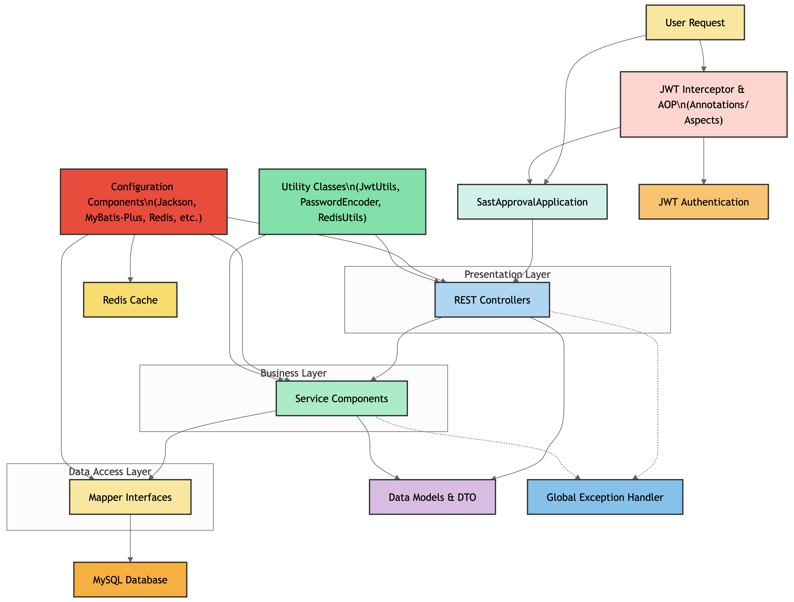

# SAST-Approval

SAST-Approval 是一款高效的项目审批系统，专为管理南邮创新杯及类似赛事的项目申报、管理、审批和评分而设计。该系统满足不同角色的需求，包括队伍管理、赛事管理和评审打分，确保整个赛事过程的顺利进行。

## 项目背景

本项目为 SAST WOC 项目。

## 已实现功能

目前系统已实现的核心功能包括：

- **用户认证**：用户登录功能
- **用户管理**：添加用户
- **比赛管理**：
  - 创建比赛
  - 获取比赛列表
- **队伍管理**：
  - 更新队伍信息
  - 添加成员
  - 删除成员
  - 获取队伍信息
  - 获取成员列表
  - 获取队伍列表

## 技术栈

### 后端

- **框架**：SpringBoot
- **数据库**：MySQL
- **ORM**：MyBatis, MyBatis-Plus
- **构建工具**：Maven
- **认证**：JWT
- **缓存**：Redis
- **安全**：Spring Security（密码加密）

## 系统架构



项目采用经典三层架构设计：

1. **控制层（Controller）**：处理HTTP请求和响应
2. **业务逻辑层（Service）**：实现核心业务逻辑
3. **数据访问层（Mapper）**：与数据库交互

同时引入了以下增强组件：

- **注解（Annotation）**：自定义注解，如角色权限控制注解
- **切面（Aspect）**：实现AOP功能，如日志记录和权限检查
- **配置类（Config）**：Jackson 序列化配置、MyBatis-Plus 配置、Redis 缓存配置、初始数据配置
- **异常处理（Exception）**：统一处理系统异常
- **拦截器（Interceptor）**：处理请求拦截和身份验证
- **模型（Model）& DTO（Data Transfer Object）**：定义数据模型和数据传输对象
- **工具类（Utils）**：提供各种工具函数
- **统一返回格式**：规范API响应结构


## 开发规范

### 后端规范

- 应用面向接口编程思想
- 使用 JWT 进行登录校验
- 密码使用密文进行存储
- 实现全局异常处理和统一返回格式
- 使用 Redis 进行缓存管理
- 使用 AOP 进行权限控制和横切关注点管理

## 项目结构

```
src/main/java/com/sast/approval/
├── SastApprovalApplication.java  # 应用入口
├── annotation/                   # 自定义注解
├── aspect/                       # AOP切面
├── config/                       # 配置类
├── controller/                   # 控制器
├── exception/                    # 异常处理
├── interceptor/                  # 拦截器
├── mapper/                       # MyBatis映射接口
├── model/                        # 数据模型
│   ├── dto/                      # 数据传输对象
├── service/                      # 服务接口与实现
└── utils/                        # 工具类
```

---

*架构图由 [ahmedkhaleel2004/gitdiagram](https://github.com/ahmedkhaleel2004/gitdiagram) 生成*